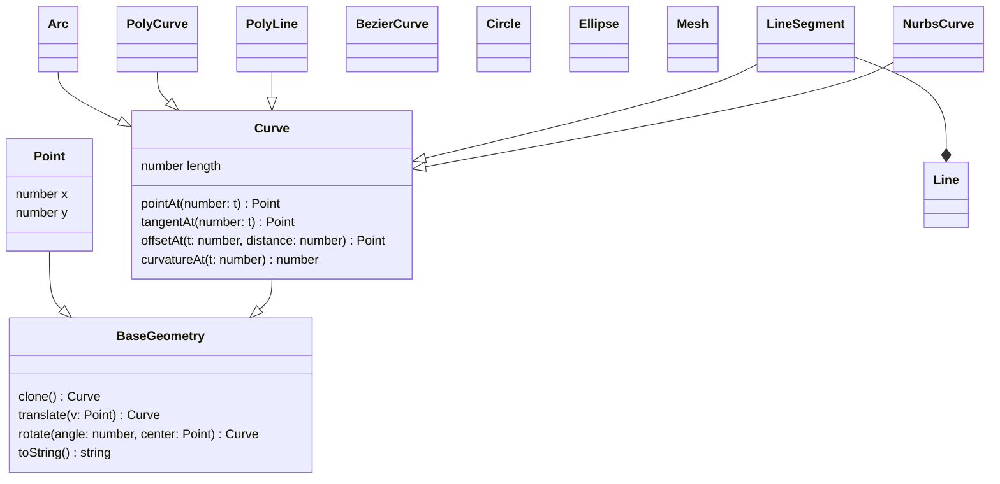

```mermaid

classDiagram


    class BaseGeometry{
        clone() Curve
        translate(v: Point) Curve
        rotate(angle: number, center: Point) Curve
        toString() string
    }

    class Point{
        number x
        number y
    }

    class Curve{
        number length

        pointAt(number: t) Point
        tangentAt(number: t) Point
        offsetAt(t: number, distance: number) Point
        curvatureAt(t: number) number
    }

    class Line{}

    class PolyLine{}

    class PolyCurve

    class Arc

    class BezierCurve

    class Circle
    class Ellipse

    class Mesh

    Point --|> BaseGeometry
    Curve --|> BaseGeometry
    Arc --|> Curve
    PolyCurve --|> Curve
    PolyLine --|> Curve
    LineSegment --|> Curve
    LineSegment --* Line
    NurbsCurve --|> Curve
```

Learnings from grasshopper

-   grids return `PolyLineCurve`s, which are `PolyLine`s here
